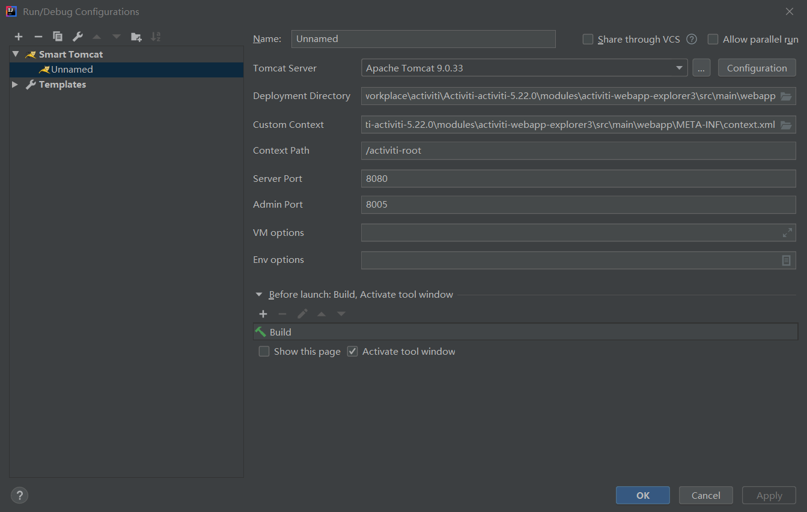

Activiti-explorer
========

IDE用的是Idea
------

配置数据库：
-------
需要本地配置mysql，相关信息如下

用户名：root

密码：wjy199042

数据库名：activitiDB

配置完数据库运行./src/main/java/com/example/demo/ActivitiDemoApplication.java以初始化数据库并将demo的流程放进数据库

配置tomcat运行Activiti-Exploer：
-------

activiti-explorer登录：
-------
用户名: wjy
密码：199042

